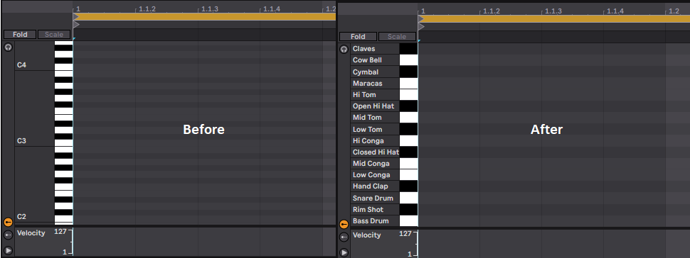
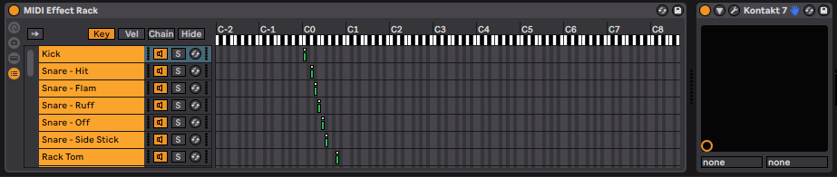
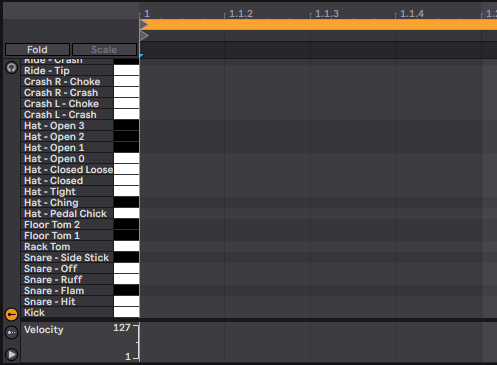

+++
title = "Custom Piano Roll Labels in Ableton Live"
description = "A quick tip on how to make working with drum VSTs more ergonomic in Live."
date = 2023-08-10

[taxonomies]
tags = ["music", "ableton"]
+++

When you use a Drum Rack in Ableton Live, the piano roll changes from showing notes to showing drum pads instead:

This feature is great - *if* you're able to use a Drum Rack! But if you're using a VST like Kontakt for your drums, you're stuck with the basic piano roll.

...or so I thought!

As it turns out, there's a way to use Ableton's MIDI Effect Racks to make VST drum libraries give you the same functionality:

1. Drag a MIDI Effect Rack onto your channel.
2. Create a named chain for each drum sound.
3. In the Key Zone Editor, map each chain to the note that triggers it.
4. Right click on one of the chains, and choose 'Show Names in MIDI Editor'.
5. Save the rack as a preset (or wrap the rack and the VST up in an Instrument Rack, and save that).

Now if you go to the piano roll, you'll have the same nice UI as you'd get with a Drum Rack!

As someone with a terrible memory for MIDI mappings, this has been an absolute lifesaver for me, and I hope it's useful for other people too!
