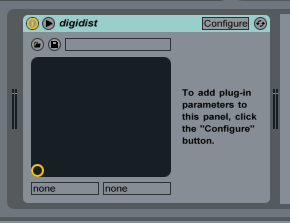
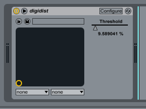

+++
title = "Writing an Audio Plugin in Rust"
date = 2017-03-25
tags = ["rust", "music"]
aliases = ["/writing-an-audio-plugin-in-rust"]
+++

> **Update:** [doomy](http://vaporsoft.net/) has written [an excellent follow-up article](http://vaporsoft.net/creating-an-audio-plugin-with-rust-vst/) to this one, showing off a [more actively maintained fork of the vst2 crate](https://crates.io/crates/vst), as well as some more advanced stuff like MIDI events. I highly recommend checking it out! All the below code should work with the new crate with little/no changes.

Along the long and slightly convoluted path I took to finding my current career as a software developer, I ended up spending a year at college studying music. It didn't really amount to much in the way of gainful employment, but [it's still something I'm really passionate about](https://soundcloud.com/17cupsofcoffee), and I'd really like to find more ways of combining it with my love of programming.

So when I stumbled across the [`vst2` Rust crate](https://github.com/overdrivenpotato/rust-vst2/) (created by the delightfully named 'overdrivenpotato'), I couldn't resist taking some time out of my Saturday to check it out.


I'm no audio programming wizard, so I'm going to start really simple by throwing together a bare-bones digital distortion effect, based on the algorithm from [this tutorial by Martin Finke](http://www.martin-finke.de/blog/articles/audio-plugins-005-digital-distortion/). You can find the final source code on GitHub [here](https://github.com/17cupsofcoffee/digidist).

# Prerequisites
To follow along with this tutorial, you'll need:

* The latest stable version of [Rust](https://www.rust-lang.org/en-US/) - 1.16.0, at the time of writing.
* A VST host to test the plugin with - I'm using Ableton Live 9, but if you don't own a DAW you can download the evaluation version of [Reaper](http://www.reaper.fm/) for free.

It's worth noting that I'm running the 64-bit version of Ableton on Windows - if you're using a 32-bit plugin host, you'll need to compile your plugin with the 32-bit Rust toolchain. If you're on Mac, you can use [zywicki's handy shell script](https://github.com/overdrivenpotato/rust-vst2/blob/master/osx_vst_bundler.sh) to package the library in a format that will work for you.

# The Bare Minimum

Let's start as simple as possible, by getting a completely empty VST plugin loading into our host. All it'll do is pass through audio unaltered - not very exciting, but it'll prove our code works.

First, create a new Rust library using Cargo:

```bash
cargo new digidist
cd digidist
```

In our `cargo.toml`, let's add a dependency on `vst2`. While we're at it, we'll also set the type of our crate to `dylib`, so that the compiler will output a dynamic library.

```toml
[package]
name = "digidist"
version = "0.1.0"
authors = ["Joe Clay <27cupsofcoffee@gmail.com>"]

[dependencies]
vst2 = "0.0.1"

[lib]
crate-type = ["dylib"]
```

Now we can actually start laying the groundwork for our plugin. In order for the `vst2` crate to work its magic, we need to do three things:

* Create a struct that implements `Default`, to represent our plugin.
* Implement the [`Plugin`](http://overdrivenpotato.github.io/rust-vst2/vst2/plugin/trait.Plugin.html) trait on our struct. This trait features many methods (some of which we'll go over later), but all of them except [`get_info`](http://overdrivenpotato.github.io/rust-vst2/vst2/plugin/trait.Plugin.html#tymethod.get_info) provide default implementations. 
* Call the [`plugin_main!`](http://overdrivenpotato.github.io/rust-vst2/src/vst2/src/lib.rs.html#144-165) macro with our struct - this generates the code that allows a host to hook into our library, as per the VST specification. 

With all that in place, our code should look something like this:

```rust
// lib.rs

#[macro_use] extern crate vst2;

use vst2::buffer::AudioBuffer;
use vst2::plugin::{Plugin, Info};

#[derive(Default)]
struct DigiDist;

impl Plugin for DigiDist {
    fn get_info(&self) -> Info {
        Info {
            name: "DigiDist".to_string(),
            vendor: "17cupsofcoffee".to_string(),
            unique_id: 25032017,

            // fill in the rest with the default values
            ..Info::default()
        }
    }
}

plugin_main!(DigiDist);
```

Believe it or not, that's all that's required to create our bare minimum VST! Run `cargo build`, and then copy `target/debug/digidist.dll` into your host's plugins folder. All being well, you should be able to load it onto a track:



# Audio Mangling

>Before we start writing our actual audio processing code, a quick warning - **make sure that you turn down your volume, and place a limiter on your host's audio output when developing VSTs!** Your ears will thank you the first time you run into a bug.

Our digital distortion plugin is going to have:

* One parameter - the loudness threshold at which to begin clipping the audio signal
* Two inputs (left and right)
* Two outputs (left and right)

We can add this information to our plugin with very little effort:

```rust
// lib.rs

impl Plugin for DigiDist {
    fn get_info(&self) -> Info {
        Info {
            name: "DigiDist".to_string(),
            vendor: "17cupsofcoffee".to_string(),
            unique_id: 25032017,

            inputs: 2,
            outputs: 2,
            parameters: 1,

            ..Info::default()
        }
    }
}
```

We're going to have to store that parameter somewhere, so let's add a field to our struct. While we're at it, we'll also manually implement `Default`, so that our threshold slider will start at the maximum value (i.e. no distortion) rather than at zero.

```rust
// lib.rs

struct DigiDist {
    threshold: f32
}

impl Default for DigiDist {
    fn default() -> DigiDist {
        DigiDist {
            threshold: 1.0
        }
    }
}
```

In order to link this field up to our VST's interface in the host application, we need to implement five methods from the `Plugin` trait, which all take an integer index:

* `get_parameter` - gets the parameter's actual value, from 0.0 to 1.0
* `set_parameter` - sets the parameter's actual value, from 0.0 to 1.0
* `get_parameter_name` - gets the text that should be displayed as the parameter's name in the host application
* `get_parameter_text` - gets the text that should be displayed as the parameter's value in the host application
* `get_parameter_label` - gets the label that should be displayed next to the value (e.g. dB, %, On/Off)

For our plugin, the implementations will look like this:

```rust
// lib.rs, inside 'impl Plugin for DigiDist'

fn get_parameter(&self, index: i32) -> f32 {
    match index {
        0 => self.threshold,
        _ => 0.0,
    }
}

fn set_parameter(&mut self, index: i32, value: f32) {
    match index {
        // We don't want to divide by zero, so we'll clamp the value
        0 => self.threshold = value.max(0.01),
        _ => (),
    }
}

fn get_parameter_name(&self, index: i32) -> String {
    match index {
        0 => "Threshold".to_string(),
        _ => "".to_string(),
    }
}

fn get_parameter_text(&self, index: i32) -> String {
    match index {
        // Convert to a percentage
        0 => format!("{}", self.threshold * 100.0),
        _ => "".to_string(),
    }
}

fn get_parameter_label(&self, index: i32) -> String {
    match index {
        0 => "%".to_string(),
        _ => "".to_string(),
    }
}
```

Now for the exciting part - let's mangle some audio! The algorithm for this distortion effect is going to be very, very simple:

```
// pseudo-code

if input >= 0
  output = min(input, threshold) / threshold
else
  output = max(input, -threshold) / threshold
```

Thanks to the nicely designed buffer API provided by the vst2 crate, our actual processing code looks pretty much the same!

```rust
// lib.rs, inside 'impl Plugin for DigiDist'

fn process(&mut self, buffer: AudioBuffer<f32>) {
    // Split out the input and output buffers into two vectors
    let (inputs, outputs) = buffer.split();

    // For each buffer, transform the samples
    for (input_buffer, output_buffer) in inputs.iter().zip(outputs) {
        for (input_sample, output_sample) in input_buffer.iter().zip(output_buffer) {

            if *input_sample >= 0.0 {
                *output_sample = input_sample.min(self.threshold) / self.threshold;
            }
            else {
                *output_sample = input_sample.max(-self.threshold) / self.threshold;
            }

        }
    }
}
```

That's it, we're done! Compile your code, install the DLL into your host, and let's see how it looks and sounds. Turn down your volume - Soundcloud's embeds are always way too loud!



<p><iframe title="Example Audio" width="100%" height="450" scrolling="no" frameborder="no" src="https://w.soundcloud.com/player/?url=https%3A//api.soundcloud.com/tracks/314423898%3Fsecret_token%3Ds-C1L7o&amp;auto_play=false&amp;hide_related=false&amp;show_comments=true&amp;show_user=true&amp;show_reposts=false&amp;visual=true"></iframe></p>

Hm. I'm not exactly Aphex Twin, am I? But it's a start!

# Wrapping Up

Hopefully you found this quick tour of the `vst2` crate as fun as I did - I'm floored by how quickly I was able to go from "hey, this sounds like it'd be a cool idea" to having a working plugin!

Honestly, that's my experience of Rust in a nutshell. This language makes so many of the things that used to only be the realm of experienced C++ programmers accessible to the rest of us - I find that really exciting!